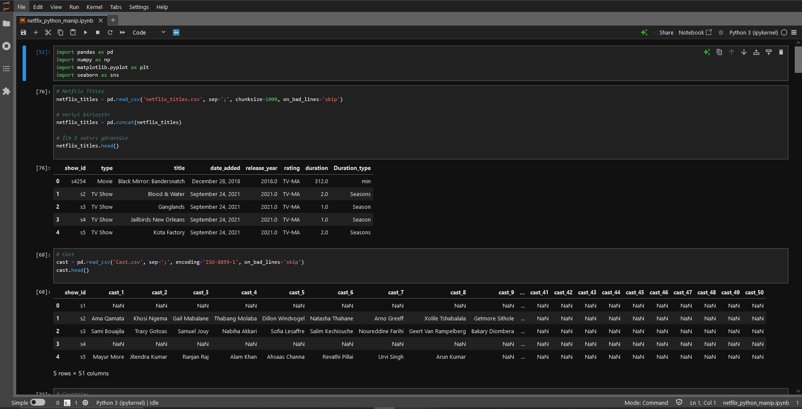
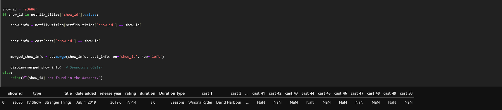
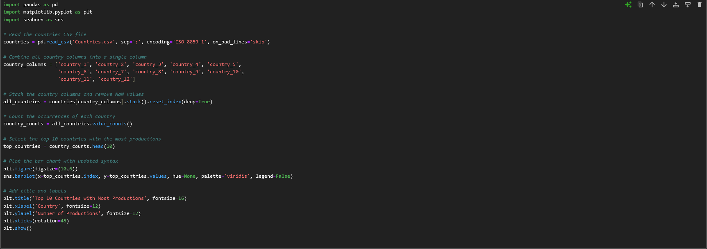
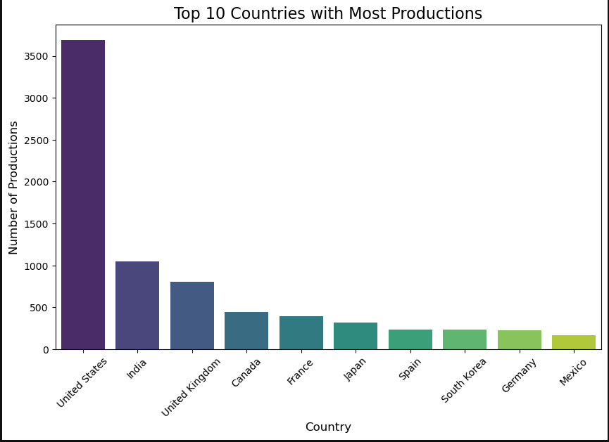
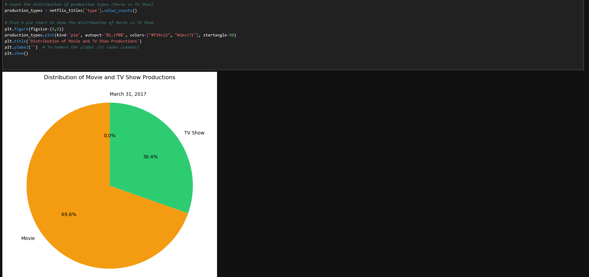
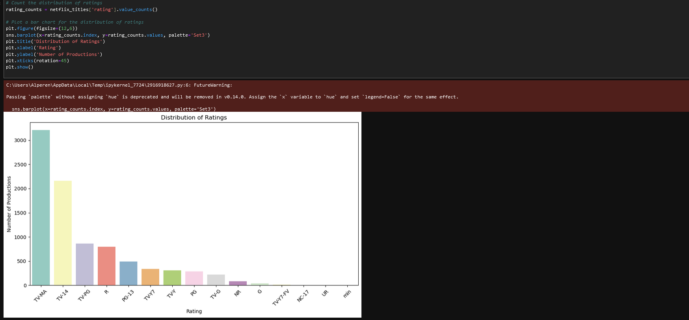
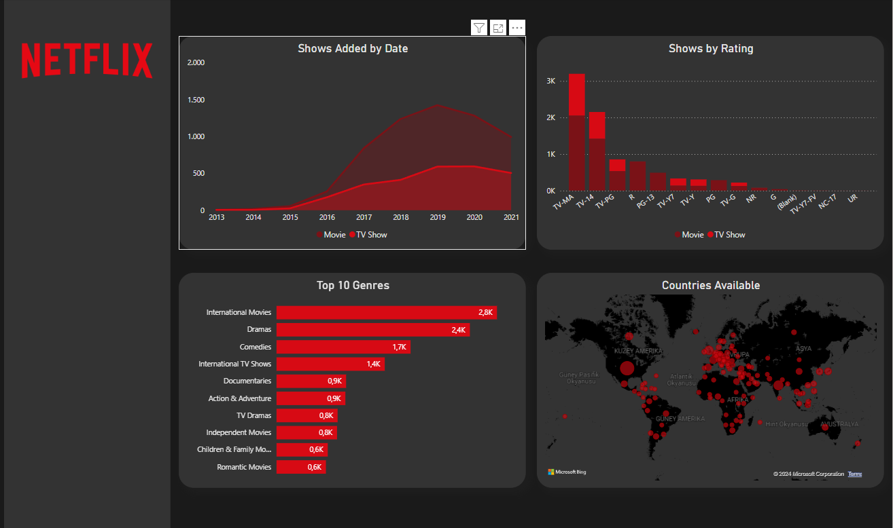
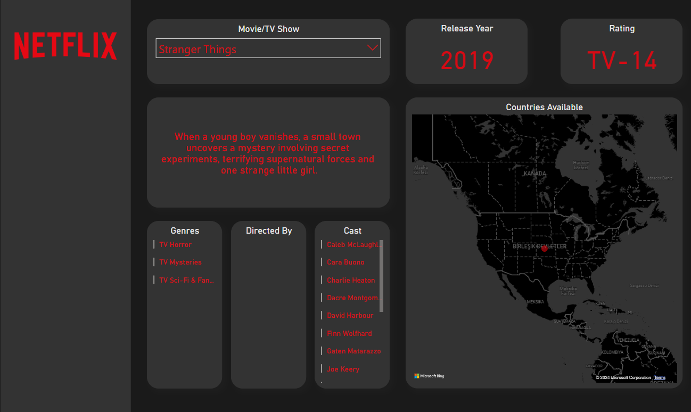

# Netflix Data Analysis Project 🎥

This project performs data analysis and visualization using the Netflix dataset. 
The project utilizes JupyterLab, Python libraries (NumPy, Pandas, Matplotlib, Seaborn), 
Microsoft Excel, MySQL, and Power BI to perform data manipulation, analysis, and visualization.

## Technologies Used
- **Python** (Pandas, NumPy, Matplotlib, Seaborn)
- **JupyterLab**
- **Microsoft Excel**
- **MySQL Workbench**
- **Power BI** (Data Visualization)
- **Dataset**: [Netflix Titles Dataset](https://www.kaggle.com/shivamb/netflix-shows)

## Key Steps
1. **Data Cleaning**:
   - Removed null values, duplicates, and irrelevant columns.
   - Standardized column names for consistency.

2. **Exploratory Data Analysis (EDA)**:
   - Used Python libraries to analyze trends like content ratings, genre distribution, and release years.
   - Visualized key insights using Seaborn and Matplotlib.

3. **SQL Analysis**:
   - Designed and executed SQL queries to identify top-performing genres and country-wise content distribution.

4. **Dashboards**:
   - Built an interactive dashboard in Power BI to summarize key metrics like content count by genre, year, and region.

## Project Structure

data/ : Contains the dataset files (CSV files).

    Cast.csv : Contains information about the actors.
    Countries.csv : The countries where the content is available.
    Description.csv : Descriptions of the content.
    Directors.csv : Information about the directors.
    Listed_in.csv : Categories that the content is listed under.
    netflix_titles.csv : The main Netflix dataset.

images/ : Screenshots of data analysis visualizations.

 
 
 
 
 
 
 
 
 
 
 
    
## Power BI Dashboard

Below is a screenshots of the Power BI dashboard created for visualizing Netflix data:

   

notebooks/ : JupyterLab Python notebooks with code.

    netflix_python_manip.ipynb : Data manipulation and visualization work.

sql_queries/ : SQL queries used for data extraction and manipulation with MySQL Workbench.

    countries_released.sql
    directors.sql
    listed_in.sql
    netflix_cast.sql
    netflix_titles.sql

visualizations/ : Power BI project file.

    Netflix_Dashboard_with_Data.pbix

## Results and Insights

- Analysis of Netflix content by country.
- Visualizing the most popular genres and trends over time.
- Statistical insights into the distribution of content across different categories (e.g., movie vs. TV show, content ratings).

## Acknowledgments

- Netflix dataset from https://www.kaggle.com/datasets/shivamb/netflix-shows.
- Libraries and tools used: Pandas, NumPy, Matplotlib, Seaborn, Power BI, Excel.
